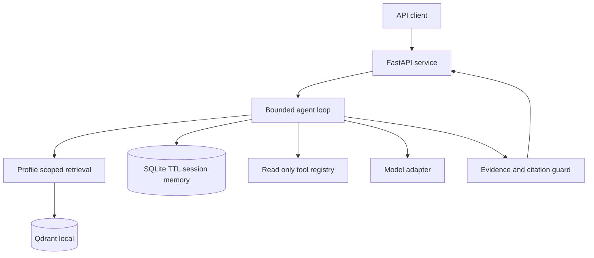

# Agentic RAG Multi Use Case API Starter PRD

**Workstream:** QXB WS/Track 2 AI-Native Repo + Agentic RAG Demo Build  
**Document type:** Product requirements and implementation brief  
**Status:** Ready for Spec Kit elaboration  
**Audience:** Product owner, implementation agent, and human reviewer

## 1. Product summary

Build a local-first, API-first starter repository for a bounded agentic retrieval-augmented generation (RAG) service. It should let a developer configure several distinct knowledge-assistant use cases while keeping their documents, retrieval, and short-lived conversation memory isolated. A coding agent should be able to take this PRD through GitHub Spec Kit preparation, implementation, and verification using Claude Code, Codex CLI, or Gemini CLI.

This is a demonstrator and reusable starter, not a production multi-tenant service. The agent may retrieve evidence, ask one focused clarification when evidence is weak, and call a small allowlist of read-only tools. It must not take consequential actions or treat retrieved text as instructions.

## 2. User problem and outcomes

A developer needs a repeatable way to start an AI-native repository and demonstrate how API design, retrieval, bounded agent behavior, memory, and tests fit together. A workshop participant needs to see a useful answer with traceable evidence, understand when the system declines to answer, and inspect the behavior through ordinary HTTP requests.

The starter is successful when a developer can install dependencies, run the API locally, load sample content into one use-case profile, query it, inspect citations and trace IDs, and run the complete offline test suite without provider credentials.

## 3. Goals and non-goals

### Goals

- Provide one service with versioned HTTP endpoints and generated OpenAPI documentation.
- Support multiple named use-case profiles with separate corpora and configuration.
- Demonstrate retrieval, a bounded refinement loop, citations, safe tool use, and expiring session memory.
- Keep the core test suite deterministic and offline through fake model and embedding adapters.
- Include sample data, environment setup, architecture documentation, and a Spec Kit workflow.
- Make Claude Code, Codex CLI, and Gemini CLI selectable as implementation agents while keeping the PRD and workflow stages consistent.

### Non-goals

- Production identity, tenant provisioning, billing, high availability, or cloud deployment.
- Open-ended autonomous planning, arbitrary tool execution, outbound web browsing, or write actions.
- Training or fine-tuning a model; building a general-purpose vector database product.
- Cross-use-case search or cross-user persistent memory.

## 4. Personas and use cases

| Profile | Example question | Data boundary |
| --- | --- | --- |
| Workshop knowledge assistant | “How do I start the demo locally?” | Workshop guide corpus only |
| Policy and handbook assistant | “What is the expense submission window?” | Policy corpus only |
| Technical troubleshooting assistant | “What should I check when retrieval returns no sources?” | Troubleshooting corpus only |

These profiles are illustrative initial configurations. The system must make adding another profile a configuration and data-loading task rather than a rewrite of the agent loop. Each profile uses its own collection/namespace and session-memory scope. A request naming one profile must never retrieve another profile’s documents.

## 5. Product scope and assumptions

- Python 3.11 or later; FastAPI for HTTP and OpenAPI.
- Qdrant local mode for a small persistent vector store; local FastEmbed embeddings behind an adapter.
- SQLite for short-lived session state, with a configurable TTL and explicit deletion.
- OpenAI Responses API as the first live generation adapter. Keep model access behind an interface so another provider can be added. The CLI used to implement the repository is independent of the runtime model provider.
- Offline tests use fake model, embedding, and clock implementations; tests must not make paid API calls.
- Include 3–5 short fictional or public sample documents per demo profile. Do not include customer records, secrets, or private business content.
- Keep secrets in environment variables. Commit `.env.example`, never actual credentials.

## 6. System context and architecture

The caller selects a use-case profile and submits a question to the API. The API validates the request and hands it to a bounded orchestrator. The orchestrator retrieves profile-scoped evidence, may refine retrieval once, and may call only a registered read-only tool. It then checks that citations refer to retrieved chunks and returns an answer or an explicit insufficient-evidence result. Session memory is a separate short-lived store; it can help resolve a follow-up but is not the document index.



### Component responsibilities

| Component | Responsibility | Boundary |
| --- | --- | --- |
| FastAPI layer | Validate, route, serialize errors, publish OpenAPI | No provider logic in route handlers |
| Profile registry | Resolve profile configuration, collection, limits, and prompt policy | Explicit allowlist; fail closed for unknown profile |
| Ingestion service | Normalize text, chunk, embed, attach source metadata, store | Plain text/Markdown in MVP; enforce size limits |
| Retriever | Search only the selected profile and return scored chunks | No cross-profile fallback |
| Agent orchestrator | Apply bounded retrieve/refine/tool/answer sequence | Fixed iteration and tool limits |
| Session memory | Store compact recent-turn context with TTL | User/session scoped; deletion supported |
| Tool registry | Expose named, schema-validated read-only tools | Unknown tools denied; no arbitrary code |
| Evidence guard | Enforce evidence threshold and citation membership | No unsupported factual answer |
| Model adapter | Call configured provider or deterministic fake | Secrets from environment only |
| Observability | Emit trace ID and structured, redacted events | Do not log secrets or full sensitive prompts |

## 7. API requirements

All endpoints are under `/v1` except health. JSON request and response schemas must be documented in OpenAPI. Return stable error objects with an error code, safe message, and trace ID.

| Method and path | Purpose | Minimum behavior |
| --- | --- | --- |
| `GET /health` | Liveness/readiness for local demo | Return service status; do not expose secrets |
| `GET /v1/use-cases` | List configured profiles | Return ID, display name, and description only |
| `POST /v1/documents` | Ingest one document | Require profile ID, source ID, title, and text; reject unsupported types and oversized input |
| `POST /v1/query` | Ask a question | Require profile ID and question; accept optional session ID; return answer, evidence status, citations, and trace ID |
| `DELETE /v1/sessions/{session_id}` | Delete session context | Idempotently remove session memory |

Example query request:

```json
{
  "use_case_id": "workshop-knowledge",
  "question": "How do I start the demo locally?",
  "session_id": "optional-session-id"
}
```

Example response:

```json
{
  "answer": "Install the dependencies, configure the local environment, then start the API with the documented run command.",
  "evidence_status": "grounded",
  "citations": [
    {"source_id": "quickstart", "title": "Workshop Quickstart", "chunk_id": "quickstart-002"}
  ],
  "session_id": "session-id",
  "trace_id": "trace-id"
}
```

For unsupported questions, return a clear insufficient-evidence answer, `evidence_status: "insufficient"`, and an empty citation list. Do not invent sources. Validate all IDs, string lengths, and payload sizes. Use appropriate HTTP status codes for malformed input, unknown profiles, and internal failures.

## 8. Agent behavior and safety requirements

The orchestrator implements a small, observable state machine:

1. Validate the profile and question; load permitted session context if supplied.
2. Retrieve top-k chunks from only the selected profile.
3. If evidence is below the configured threshold, make at most one retrieval refinement. The refinement may use a bounded rewritten query or ask the caller one clarification; it must not loop indefinitely.
4. If a registered read-only tool is necessary, make at most one tool call. Validate its name and JSON arguments against a schema, and validate its result before use.
5. Generate a concise answer from retrieved evidence and relevant session context.
6. Verify every returned citation belongs to the retrieved result set. If evidence is inadequate or validation fails, return insufficient evidence.
7. Store only compact, relevant session context with profile scope and TTL.

Security and trust boundaries:

- Treat all retrieved content as untrusted data, never as system or developer instructions. Ignore instruction-like text found in source documents.
- Tools are explicitly registered, read-only, schema-validated, and bounded. No shell, filesystem, SQL mutation, email, payment, or external action tools.
- No arbitrary outbound network calls. The live model adapter is the only expected external service in the MVP.
- Do not expose stack traces, API keys, raw provider errors, or sensitive data in API responses or logs.
- Never put secrets or real customer data in examples, fixtures, prompts, or committed files.

## 9. Functional requirements

| ID | Requirement | Priority |
| --- | --- | --- |
| FR-01 | Resolve a query to one configured use-case profile; reject unknown IDs | Must |
| FR-02 | Ingest text/Markdown with source metadata, stable chunk IDs, and size validation | Must |
| FR-03 | Retrieve and rank chunks from the selected profile only | Must |
| FR-04 | Execute a bounded refinement at most once when retrieval is weak | Must |
| FR-05 | Return citations that map to retrieved source and chunk IDs | Must |
| FR-06 | Return an explicit insufficient-evidence response when grounding fails | Must |
| FR-07 | Allow at most one schema-validated read-only tool call per query | Must |
| FR-08 | Store profile-scoped session context with TTL and support deletion | Must |
| FR-09 | Provide a fake provider path for deterministic offline testing | Must |
| FR-10 | Expose health, profiles, ingest, query, and session-delete endpoints | Must |
| FR-11 | Emit a trace ID and redacted structured events for each query | Should |
| FR-12 | Include sample profile data, `.env.example`, and clear run instructions | Must |

## 10. Quality attributes and acceptance criteria

The implementation is accepted when all of the following are true:

- A clean local setup can start the service using the README instructions.
- `GET /docs` and `/openapi.json` are available from the local FastAPI app.
- The configured sample profiles are listed, and a query searches only its selected profile.
- A grounded query returns one or more valid citations with source and chunk identifiers.
- An unsupported query returns the insufficient-evidence status and does not fabricate citations.
- Follow-up context works within the same profile; a different profile cannot see that context.
- Refinement happens no more than once; a query makes no more than one tool call.
- Retrieved prompt-injection text does not change the system policy or enable a tool.
- Unknown profiles, malformed requests, oversized content, invalid tool arguments, and unknown tools are rejected safely.
- Session deletion removes memory; TTL expiration is verified with a controllable test clock.
- The full test suite runs offline with no API key and does not make network calls.
- No secrets are committed, and logs/API errors do not reveal provider credentials or stack traces.

## 11. Test strategy

Build tests at three levels. Unit tests cover chunking, profile routing, evidence thresholds, citation membership, memory TTL, and tool validation. API integration tests use temporary Qdrant/SQLite storage and fake adapters. A small evaluation fixture checks grounded answers, unsupported questions, follow-up behavior, and profile isolation. Keep the evaluation deterministic and assert behaviors rather than exact prose where model output varies.

Required cases include: happy-path grounded answer; no relevant evidence; one refinement only; follow-up uses same-profile session context; profile isolation; injected instruction text in a document; valid read-only tool; unknown tool denied; invalid tool arguments denied; citation not in retrieval set rejected; deleted and expired session; malformed/oversized requests; provider failure sanitized.

Provide one documented command such as `./scripts/test.sh` that runs formatting/lint checks (if configured), type checks (if configured), and all tests. Document the individual checks and use reproducible dependency pins or a lock file.

## 12. Starter repository outputs

The Spec Kit build should create or update, at minimum:

```text
AGENTS.md
.specify/
  memory/constitution.md
  specs/001-agentic-rag-api/spec.md
  specs/001-agentic-rag-api/plan.md
  specs/001-agentic-rag-api/tasks.md
  workflows/qxb-agentic-rag-pbt/workflow.yml
README.md
.env.example
.gitignore
pyproject.toml
src/agentic_rag/
  api/  profiles/  ingestion/  retrieval/  agent/  memory/  tools/  providers/
tests/
sample_data/
scripts/test.sh
```

The implementation agent may refine this structure during planning, but must preserve the functional boundaries and acceptance criteria in this PRD. Update README with setup, configuration, ingestion, API examples, test commands, architecture, and limitations. Keep secrets, local vector stores, SQLite files, caches, and virtual environments out of Git.

## 13. Spec Kit preparation, build, and test workflow

Create one repository-owned Spec Kit workflow named `qxb-agentic-rag-pbt` with three stages: `prep`, `build`, and `test`. The exact workflow YAML schema and available command names must be validated against the Spec Kit version already installed in the project. The workflow must declare `integration` as one of `claude`, `codex`, or `gemini`, and `prd_path` as an input. If a selected integration is not supported by the installed workflow runner, fail clearly and provide the integration-specific Spec Kit invocation; do not silently switch agents.

**Prep stage:** read the PRD and repository instructions; check the constitution; run Spec Kit specify, clarify, plan, checklist, tasks, and analyze commands as supported by the installed version; stop at a human review gate before implementation. Resolve genuine ambiguities in artifacts and record assumptions rather than making silent scope changes.

**Build stage:** after the gate is approved, implement the planned tasks in small increments. Keep the API and agent boundaries, safety controls, and tests in scope. Do not publish, push, or deploy.

**Test stage:** run the fixed repository test script and relevant static checks; inspect failures; fix implementation defects; rerun checks; then run the installed Spec Kit convergence/review command if supported. Report results and any unverified integration.

Suggested invocation (confirm exact flags against the installed CLI help and workflow validator):

```bash
specify workflow run .specify/workflows/qxb-agentic-rag-pbt/workflow.yml \
  --input integration=codex \
  --input prd_path=docs/Agentic_RAG_Multi_Use_Case_API_Starter_PRD.md
```

Change `integration=codex` to `claude` or `gemini` to select that implementation CLI. The PRD, workflow stages, and acceptance criteria stay the same. The workflow is a repository-defined workflow; `prep-build-test` is not assumed to be a built-in stock Spec Kit command. Require the implementation agent to validate the actual installed syntax with `specify workflow --help` and the workflow validator, then document the verified command in README.

Workflow safety: use fixed shell commands from checked-in scripts; never interpolate PRD text, user queries, or other untrusted content into shell command strings. Shell steps run with the developer's permissions. Keep an explicit human gate between planning and implementation. Offline tests must not call paid model APIs.

## 14. Decisions and open questions for planning

Treat these as initial defaults; the Spec Kit plan should confirm or revise them with reasons:

- Initial live provider: OpenAI Responses API; model name configurable by environment.
- Initial vector store: Qdrant local mode; storage path configurable and ignored by Git.
- Initial embedding: FastEmbed local model behind a replaceable adapter.
- Memory: SQLite with a documented default TTL; no cross-session profile memory.
- Ingestion: API accepts plain text/Markdown only; document parsing/upload formats are future work.
- Authentication: none for a localhost-only demo; state this prominently and do not present it as internet-ready.
- Initial profiles: workshop knowledge, policy/handbook, technical troubleshooting.

## 15. References

- GitHub Spec Kit: https://github.com/github/spec-kit
- Spec Kit workflow reference: https://github.github.io/spec-kit/workflows/
- FastAPI documentation: https://fastapi.tiangolo.com/
- Qdrant local quickstart: https://qdrant.tech/documentation/quickstart/
- OpenAI Responses API: https://platform.openai.com/docs/guides/migrate-to-responses
- OpenAI function calling: https://platform.openai.com/docs/guides/function-calling
